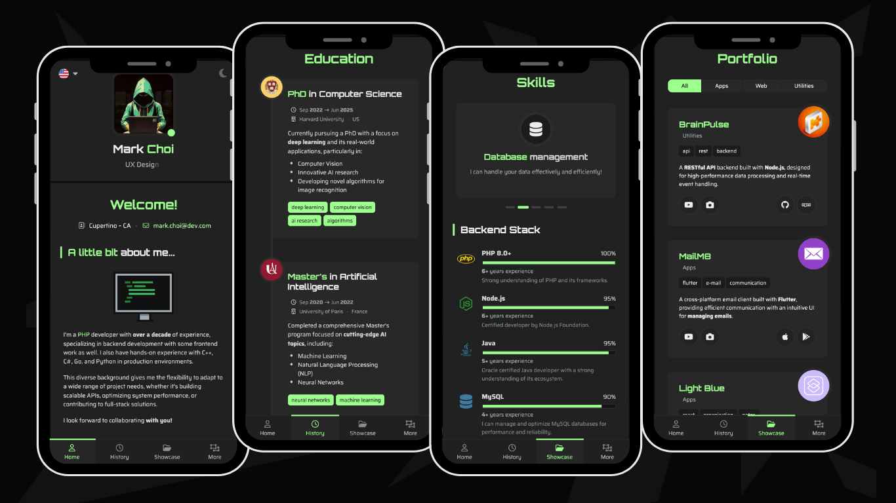

# [ React Portfolio](https://aguwa-favour.github.io/react-portfolio-template/)  
by **Aguwa Favour .E**

## Key Features
- Fully responsive design.  
- Works perfectly on mobile, tablet, and desktop.  
- Dark and light theme options.  
- Multi-language support.  
- Sections for work experience, education, skills, portfolio, and more.  
- Integrated contact form using **EmailJS** (no backend required).  

---

## Live Preview

| #     | Version                  | Description                            | URL                                                                     |
|-------|--------------------------|----------------------------------------|-------------------------------------------------------------------------|
| 🟢    | Aguwa Favour .E (default) | Official live version of my portfolio. | [View Live](https://aguwa-favour.github.io/react-portfolio-template/)   |

---

## Layout Overview

### 1. Base Layout
Clean central layout with a left sidebar, adapting to any screen size.  

### 2. Desktop
Smooth page transitions with a toggleable sidebar for larger content space.  

### 3. Mobile
Mobile-friendly with grouped sections and bottom navigation.  

---

## About Me

This portfolio was designed and is maintained by **Aguwa Favour .E**.  

I built it to showcase my work, projects, and skills in a simple and modern way.  

---

## License

Released under the [MIT](LICENSE).  
You are free to use, adapt, and share.  

⭐ Don’t forget to give it a star if you like it!  
